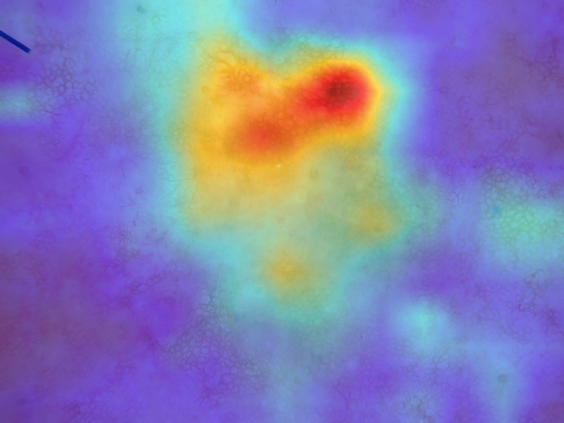

# Generalizable Ensemble Deep Learning for Dermoscopic Skin-Lesion Classification

**Internal Evaluation on HAM10000 and External Evaluation on ISIC 2019**

[](https://github.com/md-naim-hassan-saykat/skin-lesion-classification-ensemble-ham10000/actions/workflows/ci.yml)
[](https://www.python.org/)
[](https://pytorch.org/)


[](LICENSE)
[](https://doi.org/10.5281/zenodo.17390952)

[](https://colab.research.google.com/github/md-naim-hassan-saykat/skin-lesion-classification-ensemble-ham10000/blob/main/notebooks/skin_lesion_ensemble_classification.ipynb)

---

A reproducible research framework for seven-class dermoscopic skin-lesion
classification using seven convolutional and transformer-based architectures,
an equal-weight probability ensemble, retrospective harmonized evaluation on
HAM10000, and external cross-dataset evaluation on ISIC 2019.

The study examines predictive performance, cross-dataset generalization,
probabilistic calibration, paired statistical differences, and qualitative
Grad-CAM attribution within a common seven-class evaluation framework.

> **Research-use notice:** This repository contains experimental research
> software and reproducibility artifacts. The models have not undergone
> prospective clinical validation and must not be used for diagnosis,
> treatment decisions, patient triage, or other clinical decision-making.

---

## Highlights

- **Seven architectures:** custom CNN, ResNet-50, DenseNet-121,
  EfficientNet-B3, ConvNeXt-Tiny, MobileNetV3-Large, and ViT-B/16.
- **Seven-model ensemble:** equal-weight probability averaging across all seven
  models (`1/7` per model), without validation-based optimization of ensemble
  weights.
- **HAM10000 evaluation:** standardized retrospective evaluation cohort of
  **2,003 images** across seven diagnostic classes.
- **External evaluation:** harmonized **ISIC 2019 cohort of 25,331 images**
  mapped to the same seven-class label space.
- **Strongest internal model:** ViT-B/16 with **0.9591 accuracy**,
  **0.9585 weighted F1**, **0.9959 macro ROC-AUC**, and
  **0.9978 micro ROC-AUC**.
- **Strongest external model:** ConvNeXt-Tiny with **0.6963 accuracy**,
  **0.6755 weighted F1**, **0.9021 macro ROC-AUC**, and
  **0.9053 weighted ROC-AUC**.
- **Ensemble performance:** strong internally and externally, but the
  equal-weight ensemble does **not** uniformly outperform the strongest
  individual architecture.
- **Calibration:** ViT achieved the lowest HAM10000 ECE (**1.37%**), whereas
  the ensemble had an ECE of **11.54%**.
- **Statistical analysis:** McNemar's test and paired bootstrap comparisons
  quantify ensemble-versus-model differences.
- **Interpretability:** Grad-CAM is used as a qualitative model-attribution
  aid; no clinically validated localization claim is made.
- **Reproducibility:** source code, curated tables and figures, evaluation
  utilities, documentation, and associated archived artifacts are provided
  through GitHub and Zenodo.

---

## Quick Links

- [Installation guide](docs/installation.md)
- [Training pipeline](docs/training_pipeline.md)
- [Evaluation metrics](docs/evaluation_metrics.md)
- [Ensemble method](docs/ensemble_method.md)
- [Result tables](results/tables/)
- [Result figures](results/figures/)
- [Research notebook](notebooks/skin_lesion_ensemble_classification.ipynb)
- [Contributing guide](CONTRIBUTING.md)
- [Citation metadata](CITATION.cff)
- [Zenodo archive](https://doi.org/10.5281/zenodo.17390952)

---

## Table of Contents

- [Study Overview](#study-overview)
- [Datasets](#datasets)
- [Diagnostic Classes](#diagnostic-classes)
- [Models](#models)
- [Evaluation Protocol](#evaluation-protocol)
- [Ensemble Strategy](#ensemble-strategy)
- [Results](#results)
- [Calibration](#calibration)
- [Statistical Comparisons](#statistical-comparisons)
- [External Per-Class Performance](#external-per-class-performance)
- [Explainability](#explainability)
- [Reproducibility](#reproducibility)
- [Installation](#installation)
- [Data Preparation](#data-preparation)
- [Running the Repository](#running-the-repository)
- [Notebook](#notebook)
- [Repository Structure](#repository-structure)
- [Result Artifacts](#result-artifacts)
- [Environment](#environment)
- [Limitations](#limitations)
- [Ethics and Data Use](#ethics-and-data-use)
- [Citation](#citation)
- [Development and Contributions](#development-and-contributions)
- [License](#license)
- [Acknowledgements](#acknowledgements)
- [Contact](#contact)
- [Responsible Use](#responsible-use)

---

## Study Overview

This project investigates the performance and generalizability of deep
learning models for seven-class dermoscopic skin-lesion classification.

Seven fixed archived HAM10000-trained model checkpoints are evaluated using
their documented inference requirements and a common canonical output
ordering. Their class-probability predictions are additionally combined using
an equal-weight probability ensemble.

The evaluation has two complementary components:

1. **HAM10000:** retrospective harmonized comparison on a standardized
   2,003-image evaluation cohort.
2. **ISIC 2019:** external cross-dataset evaluation on a harmonized
   25,331-image cohort.

The framework evaluates multiple dimensions of model behavior:

- accuracy;
- weighted F1 score;
- macro ROC-AUC;
- micro ROC-AUC on HAM10000;
- weighted ROC-AUC on ISIC 2019;
- bootstrap confidence intervals;
- McNemar paired comparisons;
- paired bootstrap performance differences;
- Expected Calibration Error (ECE);
- confusion matrices;
- classwise ROC analysis; and
- qualitative Grad-CAM attribution.

A central finding is that **model ranking changes under cross-dataset
evaluation**. ViT provides the strongest internal point estimates, whereas
ConvNeXt-Tiny provides the strongest external point estimates.

---

## Datasets

### HAM10000

The **HAM10000** dataset contains **10,015 dermoscopic images** representing
seven common pigmented skin-lesion categories.

HAM10000 is used for the historical model-development workflows and for the
retrospective internal evaluation reported in this project.

The final harmonized internal analysis uses a standardized cohort containing:

**n = 2,003 images**

Because the archived checkpoints were generated under differing historical
training and data-partitioning pipelines, this cohort must be interpreted as a
**standardized retrospective evaluation cohort**, not as a universally
untouched test set identically held out during the historical development of
every model.

### ISIC 2019

ISIC 2019 is used for external cross-dataset evaluation.

For compatibility with the HAM10000 seven-class label space:

- ISIC 2019 `AK` and `SCC` are mapped to `akiec`; and
- only samples corresponding to the seven canonical diagnostic categories are
  retained.

The harmonized external evaluation cohort contains:

**n = 25,331 images**

The external experiment evaluates model behavior under dataset shift. It does
not constitute prospective clinical validation.

> Dataset files are not redistributed through this repository. Users must
> obtain HAM10000 and ISIC 2019 from their authorized public distributions and
> comply with the corresponding licenses and terms of use.

---

## Diagnostic Classes

All harmonized analyses use the following canonical seven-class ordering:

| Code | Diagnostic category |
|---|---|
| `akiec` | Actinic keratoses and intraepithelial carcinoma |
| `bcc` | Basal cell carcinoma |
| `bkl` | Benign keratosis-like lesions |
| `df` | Dermatofibroma |
| `mel` | Melanoma |
| `nv` | Melanocytic nevi |
| `vasc` | Vascular lesions |

Historical classifier outputs are mapped to this canonical ordering before
metric calculation or ensembling.

This step is particularly important for archived checkpoints whose original
classifier-output ordering differs from the harmonized evaluation order.

---

## Models

Seven architectures spanning conventional convolutional networks, modern CNN
families, efficient architectures, and transformers are evaluated.

| Model | Architecture family |
|---|---|
| CNN | Custom convolutional neural network |
| ResNet-50 | Residual CNN |
| DenseNet-121 | Densely connected CNN |
| EfficientNet-B3 | Compound-scaled CNN |
| ConvNeXt-Tiny | Modern convolutional architecture |
| MobileNetV3-Large | Efficient/mobile CNN |
| ViT-B/16 | Vision Transformer |

### Custom CNN

The baseline CNN uses four convolutional blocks based on:

```text
Conv → BatchNorm → ReLU → MaxPool
```

followed by a fully connected seven-class classifier.

### Transfer-learning architectures

The remaining architectures use their corresponding model definitions and
documented preprocessing/evaluation requirements.

For new repository training runs, see
[`docs/training_pipeline.md`](docs/training_pipeline.md).

---

## Evaluation Protocol

The reported study evaluates **fixed archived model checkpoints**.

The historical checkpoints were not all produced from an identical original
train/validation/test protocol. The harmonized framework therefore provides a
retrospective comparison using:

- fixed checkpoint versions;
- fixed evaluation cohorts;
- documented preprocessing;
- canonical seven-class output harmonization;
- common downstream metric calculation; and
- reproducible prediction and analysis artifacts.

For HAM10000, the final quantitative analyses are derived from the standardized
2,003-image evaluation cohort and harmonized prediction outputs.

These outputs support:

- primary performance metrics;
- bootstrap confidence intervals;
- Expected Calibration Error;
- McNemar comparisons;
- paired bootstrap differences;
- confusion matrices; and
- ROC analyses.

For ISIC 2019, the fixed HAM10000-trained models are evaluated on the same
harmonized external cohort using the corresponding inference procedures and
canonical output ordering.

### Primary metrics

**HAM10000**

- Accuracy
- Weighted F1
- Macro one-vs-rest ROC-AUC
- Micro one-vs-rest ROC-AUC

**ISIC 2019**

- Accuracy
- Weighted F1
- Macro one-vs-rest ROC-AUC
- Weighted one-vs-rest ROC-AUC

### Uncertainty analysis

For the HAM10000 uncertainty analysis:

- point estimates are calculated on the full 2,003-image evaluation cohort;
- **1,000 bootstrap resamples** are used;
- **95% bootstrap percentile confidence intervals** are reported; and
- the base random seed is **42**.

### Calibration

Expected Calibration Error is evaluated on HAM10000 using:

- maximum-confidence multiclass calibration; and
- **15 equal-width confidence bins**.

Lower ECE indicates closer agreement between predictive confidence and
observed accuracy.

For the precise metric implementations, see
[`docs/evaluation_metrics.md`](docs/evaluation_metrics.md).

---

## Ensemble Strategy

The final ensemble combines all seven evaluated models:

1. CNN
2. ResNet-50
3. DenseNet-121
4. EfficientNet-B3
5. ConvNeXt-Tiny
6. MobileNetV3-Large
7. ViT-B/16

For image $begin:math:text$i$end:math:text$, each model produces a seven-class probability vector
$begin:math:text$p\_m\^\{\(i\)\}$end:math:text$.

The ensemble probability is the arithmetic mean:

```text
p_ensemble = (p_CNN
            + p_ResNet50
            + p_DenseNet121
            + p_EfficientNetB3
            + p_ConvNeXtTiny
            + p_MobileNetV3L
            + p_ViT) / 7
```

Equivalently:

```text
p_ensemble = (1/7) × Σ p_m
```

No validation-based optimization of ensemble weights is used in the reported
final analysis.

See [`docs/ensemble_method.md`](docs/ensemble_method.md) for implementation
details and compatibility requirements.

---

# Results

## HAM10000 Internal Evaluation

Performance on the standardized **2,003-image HAM10000 evaluation cohort**:

| Model | Accuracy | Weighted F1 | Macro ROC-AUC | Micro ROC-AUC |
|---|---:|---:|---:|---:|
| **ViT** | **0.9591** | **0.9585** | **0.9959** | **0.9978** |
| **Ensemble** | **0.9386** | **0.9374** | **0.9951** | **0.9971** |
| ConvNeXt-Tiny | 0.9126 | 0.9124 | 0.9882 | 0.9937 |
| EfficientNet-B3 | 0.8997 | 0.8984 | 0.9818 | 0.9905 |
| DenseNet-121 | 0.8787 | 0.8742 | 0.9786 | 0.9892 |
| MobileNetV3-L | 0.8587 | 0.8551 | 0.9720 | 0.9857 |
| CNN | 0.7898 | 0.7763 | 0.9388 | 0.9712 |
| ResNet-50 | 0.6850 | 0.7142 | 0.9319 | 0.9386 |

**ViT achieved the highest point estimate across all four reported HAM10000
performance metrics.**

The equal-weight ensemble achieved the second-highest point estimates across
all four metrics. The reported results therefore do **not** support a claim
that the ensemble uniformly outperforms the strongest individual
architecture.

Source table:
[`results/tables/HAM10000_model_performance.csv`](results/tables/HAM10000_model_performance.csv)

### 95% bootstrap confidence intervals

| Model | Accuracy (95% CI) | Weighted F1 (95% CI) | Macro AUC (95% CI) | Micro AUC (95% CI) |
|---|---|---|---|---|
| ViT | 0.9591 [0.9506, 0.9666] | 0.9585 [0.9484, 0.9676] | 0.9959 [0.9927, 0.9978] | 0.9978 [0.9968, 0.9987] |
| Ensemble | 0.9386 [0.9281, 0.9491] | 0.9374 [0.9263, 0.9483] | 0.9951 [0.9937, 0.9963] | 0.9971 [0.9963, 0.9978] |
| ConvNeXt-Tiny | 0.9126 [0.9006, 0.9246] | 0.9124 [0.9005, 0.9253] | 0.9882 [0.9834, 0.9916] | 0.9937 [0.9918, 0.9951] |
| EfficientNet-B3 | 0.8997 [0.8862, 0.9121] | 0.8984 [0.8849, 0.9104] | 0.9818 [0.9775, 0.9855] | 0.9905 [0.9884, 0.9924] |
| DenseNet-121 | 0.8787 [0.8642, 0.8932] | 0.8742 [0.8598, 0.8889] | 0.9786 [0.9733, 0.9832] | 0.9892 [0.9869, 0.9911] |
| MobileNetV3-L | 0.8587 [0.8432, 0.8742] | 0.8551 [0.8385, 0.8719] | 0.9720 [0.9670, 0.9766] | 0.9857 [0.9833, 0.9881] |
| CNN | 0.7898 [0.7718, 0.8083] | 0.7763 [0.7569, 0.7949] | 0.9388 [0.9301, 0.9470] | 0.9712 [0.9672, 0.9747] |
| ResNet-50 | 0.6850 [0.6625, 0.7050] | 0.7142 [0.6962, 0.7320] | 0.9319 [0.9226, 0.9399] | 0.9386 [0.9321, 0.9446] |

Source table:
[`results/tables/HAM10000_master_results_with_95CI.csv`](results/tables/HAM10000_master_results_with_95CI.csv)

### Internal performance figures


---

## ISIC 2019 External Evaluation

The same fixed HAM10000-trained models are evaluated on the harmonized
**25,331-image ISIC 2019 external evaluation cohort**.

| Model | Accuracy | Weighted F1 | Macro ROC-AUC | Weighted ROC-AUC |
|---|---:|---:|---:|---:|
| CNN | 0.5816 | 0.5331 | 0.7594 | 0.7744 |
| ResNet-50 | 0.4969 | 0.5198 | 0.8116 | 0.8117 |
| DenseNet-121 | 0.6842 | 0.6538 | 0.8883 | 0.8873 |
| EfficientNet-B3 | 0.6344 | 0.5774 | 0.8730 | 0.8770 |
| **ConvNeXt-Tiny** | **0.6963** | **0.6755** | **0.9021** | **0.9053** |
| MobileNetV3-L | 0.6430 | 0.6017 | 0.8592 | 0.8570 |
| ViT | 0.6651 | 0.6239 | 0.8995 | 0.8962 |
| Ensemble | 0.6830 | 0.6446 | 0.8981 | 0.9011 |

**ConvNeXt-Tiny achieved the highest point estimate across all four external
evaluation metrics.**

The change in ranking relative to HAM10000 demonstrates
architecture-dependent sensitivity to cross-dataset domain shift. In
particular, ViT provides the strongest internal results but does not retain
the highest external ranking.

Source table:
[`results/tables/ISIC2019_model_performance.csv`](results/tables/ISIC2019_model_performance.csv)

### External ensemble ROC curves


---

## Calibration

Expected Calibration Error on the standardized HAM10000 evaluation cohort:

| Model | ECE (%) |
|---|---:|
| **ViT** | **1.37** |
| CNN | 3.13 |
| EfficientNet-B3 | 4.46 |
| ConvNeXt-Tiny | 5.47 |
| MobileNetV3-L | 6.66 |
| DenseNet-121 | 6.96 |
| ResNet-50 | 9.33 |
| Ensemble | 11.54 |

ViT achieved the lowest ECE (**1.37%**).

The ensemble exhibited the highest ECE (**11.54%**), illustrating that strong
classification and discrimination performance does not necessarily imply
well-calibrated predictive probabilities.

Explicit ensemble-level calibration should be investigated before
probability estimates are considered for downstream clinical interpretation.

Source table:
[`results/tables/HAM10000_calibration_ece.csv`](results/tables/HAM10000_calibration_ece.csv)

---

## Statistical Comparisons

### McNemar's test

Paired classification outcomes between the equal-weight ensemble and each
individual model were compared on HAM10000.

| Comparison | b | c | p-value |
|---|---:|---:|---:|
| Ensemble vs CNN | 322 | 24 | 2.176 × 10⁻⁵⁷ |
| Ensemble vs ResNet-50 | 540 | 32 | 9.810 × 10⁻¹⁰⁰ |
| Ensemble vs DenseNet-121 | 137 | 17 | 8.869 × 10⁻²² |
| Ensemble vs EfficientNet-B3 | 100 | 22 | 3.141 × 10⁻¹² |
| Ensemble vs ConvNeXt-Tiny | 84 | 32 | 2.188 × 10⁻⁶ |
| Ensemble vs MobileNetV3-L | 175 | 15 | 8.781 × 10⁻³¹ |
| Ensemble vs ViT | 47 | 88 | 5.760 × 10⁻⁴ |

Here:

- `b > c` favors the ensemble;
- `c > b` favors the individual model.

The paired comparison therefore favors the ensemble relative to CNN,
ResNet-50, DenseNet-121, EfficientNet-B3, ConvNeXt-Tiny, and
MobileNetV3-Large.

The comparison with **ViT favors ViT**.

Source table:
[`results/tables/HAM10000_mcnemar_ensemble_vs_models.csv`](results/tables/HAM10000_mcnemar_ensemble_vs_models.csv)

### Paired bootstrap: ensemble minus ViT

| Metric | Δ Estimate | 95% CI |
|---|---:|---|
| Accuracy | -0.0205 | [-0.0320, -0.0090] |
| Weighted F1 | -0.0211 | [-0.0327, -0.0092] |
| Macro ROC-AUC | -0.0008 | [-0.0029, 0.0020] |

Negative values favor ViT.

The accuracy and weighted F1 confidence intervals remain below zero, whereas
the macro ROC-AUC difference is small and its confidence interval includes
zero.

Additional statistical artifacts:

- [`HAM10000_paired_bootstrap_differences.csv`](results/tables/HAM10000_paired_bootstrap_differences.csv)
- [`HAM10000_point_deltas_ensemble_vs_models.csv`](results/tables/HAM10000_point_deltas_ensemble_vs_models.csv)

---

## External Per-Class Performance

Per-class F1 scores on the harmonized ISIC 2019 external evaluation cohort:

| Model | AKIEC | BCC | BKL | DF | MEL | NV | VASC |
|---|---:|---:|---:|---:|---:|---:|---:|
| CNN | 0.13 | 0.32 | 0.32 | 0.00 | 0.32 | 0.76 | 0.56 |
| ResNet-50 | 0.24 | 0.37 | 0.31 | 0.15 | 0.27 | 0.73 | 0.26 |
| DenseNet-121 | 0.34 | **0.46** | 0.49 | 0.43 | 0.52 | 0.82 | 0.71 |
| EfficientNet-B3 | 0.33 | 0.38 | 0.40 | 0.23 | 0.37 | 0.77 | 0.74 |
| **ConvNeXt-Tiny** | **0.37** | 0.44 | **0.52** | **0.47** | **0.53** | **0.85** | **0.75** |
| MobileNetV3-L | 0.23 | 0.38 | 0.43 | 0.34 | 0.44 | 0.80 | 0.68 |
| ViT | 0.19 | 0.43 | 0.46 | 0.39 | 0.48 | 0.81 | 0.74 |

ConvNeXt-Tiny achieved the highest reported F1 for **AKIEC, BKL, DF, MEL,
NV, and VASC**, whereas DenseNet-121 achieved the highest F1 for **BCC**.

Source table:
[`results/tables/ISIC2019_per_class_F1.csv`](results/tables/ISIC2019_per_class_F1.csv)

### Ensemble classwise ROC-AUC on ISIC 2019

| Class | ROC-AUC |
|---|---:|
| AKIEC | 0.834 |
| BCC | 0.898 |
| BKL | 0.878 |
| DF | 0.920 |
| MEL | 0.843 |
| NV | 0.933 |
| VASC | 0.980 |

The ensemble's highest classwise external AUC was observed for
**VASC (0.980)**, followed by **NV (0.933)** and **DF (0.920)**.

---

## Explainability

Grad-CAM is used to qualitatively examine spatial attribution patterns
associated with model predictions.

For the equal-weight ensemble:

1. attribution maps are generated independently for the seven component
   models;
2. each model uses its corresponding inference preprocessing and class-output
   mapping;
3. individual attribution maps are normalized independently;
4. maps are resized to a common spatial resolution; and
5. the normalized maps are combined using equal-weight averaging.

The attribution analysis uses the same fixed archived checkpoints as the
quantitative evaluation.

The repository contains:

- representative per-class HAM10000 ensemble attribution maps; and
- same-image melanoma comparisons across CNN, ResNet-50, DenseNet-121, ViT,
  and the ensemble.

Example:



> **Important:** Grad-CAM results are qualitative interpretability aids. They
> were not evaluated against dermatologist annotations or localization ground
> truth and must not be interpreted as evidence of causal attribution,
> clinically validated lesion localization, or superior clinical
> explainability.

---

## Reproducibility

The repository is designed to support independent verification of the
reported analyses.

The final evaluation framework is based on:

- fixed archived model checkpoints;
- documented inference and preprocessing requirements;
- standardized HAM10000 evaluation cohort;
- harmonized ISIC 2019 external evaluation cohort;
- canonical seven-class output mapping;
- harmonized prediction outputs;
- standardized downstream metric calculations; and
- released statistical and visualization artifacts.

### Important reproducibility note

The seven archived checkpoints were produced under **different historical
training and data-partitioning pipelines**.

Accordingly, reproducibility in this repository primarily means reproducing
the **evaluation of the fixed archived models** using the documented cohorts,
preprocessing procedures, class mappings, prediction outputs, and downstream
analysis.

It does **not** imply that all seven architectures were originally trained
prospectively using the same predefined train/validation/test split.

This distinction is essential when interpreting the retrospective HAM10000
comparison.

---

## Installation

Python **3.11** is the recommended environment.

Clone the repository:

```bash
git clone https://github.com/md-naim-hassan-saykat/skin-lesion-classification-ensemble-ham10000.git
cd skin-lesion-classification-ensemble-ham10000
```

Create a virtual environment:

```bash
python3.11 -m venv .venv
source .venv/bin/activate
```

On Windows:

```powershell
py -3.11 -m venv .venv
.venv\Scripts\activate
```

Install project dependencies:

```bash
python -m pip install --upgrade pip
python -m pip install -r requirements.txt
```

For development and repository validation:

```bash
python -m pip install -r requirements-ci.txt
pre-commit install
```

For additional details, see
[`docs/installation.md`](docs/installation.md).

---

## Data Preparation

### HAM10000

Common HAM10000 distributions contain:

```text
HAM10000_images_part_1.zip
HAM10000_images_part_2.zip
HAM10000_metadata.csv
```

The repository provides:

```bash
bash scripts/prepare_ham10000.sh
```

to assist with preparation and validation of the raw HAM10000 image
collection.

The complete dataset should contain **10,015 images**.

The script prepares the raw dataset resources; it should not be interpreted as
reconstructing a universally shared historical train/validation split for all
archived checkpoints.

### ISIC 2019

For external evaluation, obtain the public ISIC 2019 image and ground-truth
resources from the official ISIC distribution.

The external evaluation retains samples mapped to:

```text
akiec
bcc
bkl
df
mel
nv
vasc
```

with `AK` and `SCC` mapped to the common `akiec` category.

After harmonization, the reported external cohort contains **25,331 images**.

---

## Running the Repository

Set the repository root on `PYTHONPATH` when needed:

```bash
export PYTHONPATH="$PWD"
```

### Repository validation

Run the complete local repository validation workflow:

```bash
make verify
```

This runs the configured pre-commit checks and automated test suite.

### Training a new model

The repository training interface supports:

```text
cnn
resnet50
densenet121
efficientnet_b3
convnext_tiny
mobilenet_v3_large
vit_b_16
```

Example:

```bash
python -m src.train \
  --model resnet50 \
  --config src/config.yaml
```

These commands are intended for new repository training runs. They should not
be assumed to reconstruct every historical archived manuscript checkpoint
exactly.

See
[`docs/training_pipeline.md`](docs/training_pipeline.md)
for dataset layout, preprocessing, optimization, and output details.

### Evaluate archived checkpoints

The batch evaluation workflow is provided through:

```bash
bash scripts/eval_all.sh
```

Before running it, ensure that:

1. the required checkpoint files are available;
2. dataset paths are configured correctly;
3. checkpoint-specific compatibility requirements are preserved;
4. output class ordering is mapped correctly; and
5. the required seven model outputs are available before constructing the
   ensemble.

The reported manuscript values should be reproduced from the documented fixed
checkpoint and harmonized evaluation artifacts rather than by substituting
alternative checkpoints or post-hoc tuned predictions.

---

## Notebook

The main research notebook is available at:

[`notebooks/skin_lesion_ensemble_classification.ipynb`](notebooks/skin_lesion_ensemble_classification.ipynb)

It may be used in:

- a local Python environment;
- Kaggle; or
- Google Colab.

### Local

Install the repository dependencies:

```bash
python -m pip install -r requirements.txt
```

Then configure dataset and checkpoint paths for the local environment.

### Kaggle

Attach the required HAM10000 and/or ISIC 2019 resources and update
environment-specific paths before running the notebook.

### Google Colab

The repository requirements can be installed with:

```python
!pip install -r requirements.txt
```

when the repository has been cloned into the Colab environment.

If Google Drive is used for datasets or checkpoints:

```python
from google.colab import drive

drive.mount("/content/drive")
```

> Paths are environment-specific. Reproducing the final reported results
> requires the same fixed checkpoints, evaluation-cohort definitions,
> preprocessing procedures, and class mappings used by the released
> evaluation artifacts.

---

## Repository Structure

```text
skin-lesion-classification-ensemble-ham10000/
│
├── .github/
│   ├── ISSUE_TEMPLATE/
│   ├── pull_request_template.md
│   └── workflows/
│       └── ci.yml
│
├── docs/
│   ├── ensemble_method.md
│   ├── evaluation_metrics.md
│   ├── installation.md
│   └── training_pipeline.md
│
├── notebooks/
│   └── skin_lesion_ensemble_classification.ipynb
│
├── results/
│   ├── figures/
│   └── tables/
│
├── scripts/
│   ├── eval_all.sh
│   └── prepare_ham10000.sh
│
├── src/
│   ├── config.yaml
│   ├── data.py
│   ├── ensemble.py
│   ├── evaluate.py
│   ├── train.py
│   └── utils.py
│
├── tests/
│
├── .gitattributes
├── .gitignore
├── .pre-commit-config.yaml
├── CITATION.cff
├── CODE_OF_CONDUCT.md
├── CONTRIBUTING.md
├── LICENSE
├── Makefile
├── metadata.yaml
├── pyproject.toml
├── pytest.ini
├── requirements-ci.txt
├── requirements.txt
└── README.md
```

Generated experimental outputs may be written locally under `outputs/`,
whereas curated manuscript and reproducibility artifacts are maintained under
`results/`.

---

## Result Artifacts

### Curated tables

The repository currently provides the manuscript and supplementary result
tables in machine-readable CSV form:

- [`HAM10000_model_performance.csv`](results/tables/HAM10000_model_performance.csv)
- [`HAM10000_master_results_with_95CI.csv`](results/tables/HAM10000_master_results_with_95CI.csv)
- [`HAM10000_calibration_ece.csv`](results/tables/HAM10000_calibration_ece.csv)
- [`HAM10000_mcnemar_ensemble_vs_models.csv`](results/tables/HAM10000_mcnemar_ensemble_vs_models.csv)
- [`HAM10000_paired_bootstrap_differences.csv`](results/tables/HAM10000_paired_bootstrap_differences.csv)
- [`HAM10000_point_deltas_ensemble_vs_models.csv`](results/tables/HAM10000_point_deltas_ensemble_vs_models.csv)
- [`ISIC2019_model_performance.csv`](results/tables/ISIC2019_model_performance.csv)
- [`ISIC2019_per_class_F1.csv`](results/tables/ISIC2019_per_class_F1.csv)

### Curated figures

Curated figures are maintained under:

[`results/figures/`](results/figures/)

They include:

- HAM10000 and ISIC 2019 ensemble confusion matrices;
- HAM10000 model-comparison figures;
- HAM10000 ensemble ROC curves;
- ISIC 2019 ensemble ROC curves;
- per-class ensemble Grad-CAM examples; and
- same-image melanoma attribution comparisons.

### Larger reproducibility artifacts

Larger archived resources are distributed through Zenodo where applicable,
including model, prediction, and supporting analysis artifacts associated with
the study.

**Zenodo DOI:**  
[10.5281/zenodo.17390952](https://doi.org/10.5281/zenodo.17390952)

GitHub should be treated as the version-controlled code and curated-results
repository, while Zenodo provides the persistent archival record for the
associated release.

---

## Environment

The recommended repository environment is:

| Component | Version / support |
|---|---|
| Python | **3.11** |
| PyTorch | **2.9.0** |
| torchvision | **0.24.0** |
| Operating systems | Linux, macOS; Windows for supported workflows |
| CUDA | Supported when available |
| Apple MPS | Supported where compatible |
| CPU | Supported; computationally slower for deep-learning workloads |

For the authoritative dependency specification, see:

- [`requirements.txt`](requirements.txt)
- [`requirements-ci.txt`](requirements-ci.txt)

---

## Limitations

### 1. Retrospective internal harmonization

The archived model checkpoints were produced under differing historical
training and data-partitioning pipelines.

The standardized 2,003-image HAM10000 cohort therefore represents a
**retrospective harmonized comparison cohort**, not a common untouched test
split identically held out during development of every model.

### 2. External domain shift

Performance changes substantially for several architectures on ISIC 2019.

Potential differences between HAM10000 and ISIC 2019 include:

- acquisition conditions;
- institutional sources;
- class distributions;
- lesion appearance;
- image-processing characteristics; and
- other dataset-specific factors.

The current experiments do not isolate the causal contribution of individual
sources of domain shift.

### 3. Calibration

The ensemble achieved strong discrimination metrics but an ECE of **11.54%**
on HAM10000.

Independent calibration assessment and explicit calibration procedures would
be required before predictive probabilities could be considered for clinical
decision support.

### 4. Interpretability

Grad-CAM analysis was performed qualitatively on representative HAM10000
examples.

Corresponding attribution analysis on the external ISIC 2019 cohort was not
part of the reported study.

### 5. No dermatologist validation

Predictions and attribution maps were not evaluated by dermatologists.

The results therefore do not establish clinical diagnostic utility or
clinically meaningful localization.

### 6. Further external validation

Additional evaluation across independent institutions, demographic groups,
acquisition settings, and prospective clinical cohorts is needed before
claims of real-world clinical generalizability can be supported.

---

## Ethics and Data Use

This study uses publicly available, de-identified dermoscopic datasets:

- HAM10000
- ISIC 2019

No new human participants, identifiable patient information, or animal
subjects were enrolled or collected by this project.

The repository contains no newly collected identifiable patient data.

Users remain responsible for complying with the licenses, access conditions,
and data-use requirements of the original dataset providers.

Dataset composition, class imbalance, demographic representation, fairness,
calibration, and cross-domain generalization remain important considerations
for future clinical translation.

---

## Paper / Manuscript

**Title**

*Generalizable Ensemble Deep Learning for Dermoscopic Skin-Lesion
Classification: Internal Evaluation on HAM10000 and External Evaluation on
ISIC 2019*

**Author**

Md Naim Hassan Saykat

**Affiliation**

Department of Computer Science, Université Paris-Saclay, France

**Associated reproducibility archive**

[Zenodo DOI: 10.5281/zenodo.17390952](https://doi.org/10.5281/zenodo.17390952)

---

## Citation

If you use the repository, software, evaluation framework, or associated
reproducibility artifacts, please cite the archived project:

```bibtex
@misc{saykat2025dermoscopic,
  author    = {Saykat, Md Naim Hassan},
  title     = {Generalizable Ensemble Deep Learning for Dermoscopic Skin-Lesion Classification: Internal Evaluation on HAM10000 and External Evaluation on ISIC 2019},
  year      = {2025},
  publisher = {Zenodo},
  doi       = {10.5281/zenodo.17390952},
  url       = {https://doi.org/10.5281/zenodo.17390952},
  note      = {Software and reproducibility archive}
}
```

Machine-readable citation metadata are provided in
[`CITATION.cff`](CITATION.cff).

---

## Development and Contributions

Contributions that improve reproducibility, documentation, testing,
evaluation, or code quality are welcome.

Set up the development environment:

```bash
git clone https://github.com/md-naim-hassan-saykat/skin-lesion-classification-ensemble-ham10000.git
cd skin-lesion-classification-ensemble-ham10000

python3.11 -m venv .venv
source .venv/bin/activate

python -m pip install --upgrade pip
python -m pip install -r requirements.txt -r requirements-ci.txt

pre-commit install
```

Run the complete repository validation suite before submitting changes:

```bash
make verify
```

Please review:

- [`CONTRIBUTING.md`](CONTRIBUTING.md)
- [`CODE_OF_CONDUCT.md`](CODE_OF_CONDUCT.md)
- [`SECURITY.md`](SECURITY.md)

For bugs or reproducibility problems, open an issue using the repository issue
templates.

---

## Future Work

Important directions include:

- prospectively training all architectures under one predefined
  train/validation/test protocol;
- evaluation on additional independent clinical datasets;
- domain adaptation and domain generalization;
- explicit ensemble-level calibration;
- external-dataset attribution analysis;
- self-supervised and semi-supervised learning;
- multimodal clinical information;
- subgroup and fairness analyses;
- dermatologist reader studies; and
- comparison of model attributions with clinically meaningful reference
  annotations.

---

## Keywords

Dermoscopic Image Analysis · Skin-Lesion Classification · HAM10000 ·
ISIC 2019 · Deep Learning · Ensemble Learning · Vision Transformer · ConvNeXt ·
External Evaluation · Domain Shift · Model Calibration · Grad-CAM ·
Explainable AI · Medical Imaging · Reproducibility

---

## License

The repository software is released under the **MIT License**.

See [`LICENSE`](LICENSE) for details.

Dataset licenses, pretrained-weight licenses, and third-party material remain
governed by their respective providers and are not relicensed by this
repository.

---

## Acknowledgements

This research was conducted independently as part of the Master's programme
in Artificial Intelligence at **Université Paris-Saclay**.

The author's academic studies were supported by the **French Government
Scholarship (BGF — Bourses du Gouvernement Français)**. The scholarship did
not specifically fund the design, implementation, or reporting of this
research.

Computational experiments were conducted using publicly accessible
**Kaggle cloud infrastructure**.

The author acknowledges:

- the creators and maintainers of HAM10000;
- the International Skin Imaging Collaboration (ISIC);
- the developers and maintainers of PyTorch and torchvision; and
- the broader open-source scientific Python ecosystem supporting this work.

---

## Contact

**Md Naim Hassan Saykat**  
Department of Computer Science  
Université Paris-Saclay  
France

Academic correspondence:  
`md-naim-hassan.saykat@universite-paris-saclay.fr`

Project and collaboration correspondence:  
`mdnaimhassansaykat@gmail.com`

GitHub:  
[md-naim-hassan-saykat](https://github.com/md-naim-hassan-saykat)

---

## Need Help?

For installation, evaluation, or reproducibility problems, open an issue:

[Open a GitHub issue](https://github.com/md-naim-hassan-saykat/skin-lesion-classification-ensemble-ham10000/issues/new/choose)

Please include, where relevant:

- operating system;
- Python version;
- PyTorch version;
- dataset being evaluated;
- model/checkpoint name;
- command executed; and
- complete error message or traceback.

Do not include patient information, credentials, API keys, private datasets,
or other sensitive material in public issues.

---

## Responsible Use

This repository provides experimental research software for dermoscopic image
classification.

It is **not a medical device**, has **not undergone prospective clinical
validation**, and must **not** be used independently for diagnosis, treatment
decisions, patient triage, or other clinical decision-making.

The reported results should be interpreted in the context of the documented
methodological limitations, particularly retrospective internal
harmonization, cross-dataset shift, calibration differences, and the absence
of dermatologist validation.
